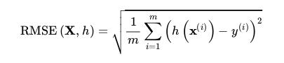
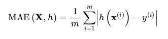
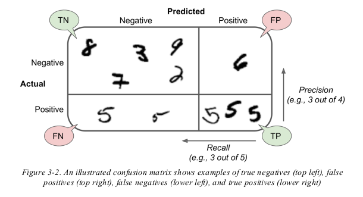

# My-100-Days-Of-Machine-Learning

## Day - 1

* Learned basics of python in kaggle python course
* Completed chapter-1 in Machine Learning book
* Got idea about different types of machine learning systems

Supervised vs Unsupervised learning

Reinforcement Learning

Batch and Online Learning

Instance-Based vs Model-Based Learning

* Implemented Linear Regression

import model from sklearn
``import sklearn.linear_model``

Load model into a variable ``model = sklearn.linear_model.LinearRegression()``

Fit the model using ``model.fit(X,y)`` Here   `X` is feature and `y` is the value we are trying to predict. 

Then predict for a new value of X using ``model.predict(X_new)``


## Day - 2

### How to approach a machine learning problem?

1. Frame the problem. 
* Is it supervised or unsupervised, or Reinforcement Learning? Is it a classification task, a regression task, or something else? Should you use batch learning or online learning techniques?
2. Select a Performance Measure

- Eg: Root Mean Squared Error, Mean Absolute Error
  
  []
  []
  
Here 

m = number of instances in the dataset you are measuring the
RMSE on.
* For example, if you are evaluating the RMSE on a validation set of 2,000 districts, then m = 2,000.
* x (i) is a vector of all the feature values (excluding the label) of the
  i th instance in the dataset, and y (i) is its label (the desired output
  value for that instance).

* X is a matrix containing all the feature values (excluding labels)
  of all instances in the dataset. There is one row per instance, and
  the i th row is equal to the transpose of x (i) , noted (x (i) ) ⊺ .
  
* h is system’s prediction function, also called a hypothesis.
  When system is given an instance’s feature vector x (i) , it
  outputs a predicted value ŷ (i) = h(x (i) ) for that instance (ŷ is
  pronounced “y-hat”).
  
3. Check the assumptions
4. Get the data
5. Take a Quick Look at the Data Structure
   1. check for types
    2. check if any types of objects or strings found
6. Create a test set
   1. This will be used to test the against the model once training is done
7. Stratified sampling: To avoid sampling bias
8. Discover and Visualize the Data to Gain
   Insights 
   1. Look for Correlations 
      2. **Standard Correlation coefficient:**
   The correlation coefficient only measures linear correlations (“if x goes up, then y
   generally goes up/down”). It may completely miss out on nonlinear relationships (e.g.,
   “if x is close to 0, then y generally goes up”). Note how all the plots of the bottom row
   have a correlation coefficient equal to 0, despite the fact that their axes are clearly not
   independent: these are examples of nonlinear relationships. Also, the second row shows
   examples where the correlation coefficient is equal to 1 or –1; notice that this has nothing
   to do with the slope. For example, your height in inches has a correlation coefficient of 1
   with your height in feet or in nanometers.
         
9. Experimenting with Attribute Combinations

**Prepare the Data for Machine Learning
Algorithms**

10. Data cleaning
    1. Missing data for some columns for an attribute
        **options:**
       1. Get rid of those rows
        2. Set the values to some value (zero, the mean, the median etc.)
    ```Scikit-Learn provides a handy class to take care of missing values: SimpleImputer```
           
    2. Handling Text and Categorical Attributes
        1. ```Scikit-Learn’s OrdinalEncoder``` : Converts categorical attributes to numbersd
        2. **One hot encoding:** : ```from sklearn.preprocessing import OneHotEncoder``` => This gives sparse matrix instead of Numpy array
    3. **Feature Scaling:** 
        1. With few exceptions, Machine Learning algorithms don’t
           perform well when the input numerical attributes have very different scales.
        2. There are two common ways to get all attributes to have the same scale: min-
           max scaling and standardization.   
            1. MinMax Scaling: Substract the min value and then divide by max minus min ``sklearn provide MinMaxScaler``
            2. Standardization: Substract mean value (so standardized values always have zero mean) and then divide by standard deviation so that resulting distribution has unit variance ```            2. Standardization: Substract mean value (so standardized values always have zero mean) and then divide by standard deviation so that resulting distribution has unit variance ``sklearn StandardScaler``
    
## Day - 3

11. Transformation Pipelines

    ```from sklearn.pipeline import Pipeline```

    To Transform columns ```from sklearn.compose import ColumnTransformer```

12. Select and Train a Model

13. Try different models and test the model accuracy and select the one which performs best

14. Fine tune the model

    1. Grid Search: In order to find the optimum hyperparameters for the model, instead of testing each combination manually, we can use scikit-learn's ```GridSearchCV```

    Eg: 
    ```
    from sklearn.model_selection import GridSearchCV
    param_grid = [{'n_estimators': [3, 10, 30], 'max_features': [2, 4, 6, 8]},
    {'bootstrap': [False], 'n_estimators': [3, 10], 'max_features': [2, 3,4]},]
    forest_reg = RandomForestRegressor()
    grid_search = GridSearchCV(forest_reg, param_grid, cv=5,
    scoring='neg_mean_squared_error',return_train_score=True)
    grid_search.fit(housing_prepared, housing_labels)```

## Day - 4

### Classification:
* A perfect classifier would have
only true positives and true negatives, so its confusion matrix would have
nonzero values only on its main diagonal (top left to bottom right)
  
**Confusion Matrix:**

[]

```            
Precision = TP/(TP+FP)
Recall    = TP/(TP+FN)

The F1 score is the harmonic mean of precision and recall

F1  = 2/((1/precision)+(1/recall))
    = 2 * (precision*recall) / (precision + recall)
```
Note: If you trained a classifier to detect videos that are safe for kids, you would
probably prefer a classifier that rejects many good videos (low recall) but
keeps only safe ones (high precision), rather than a classifier that has a
much higher recall but lets a few really bad videos show up in your
product (in such cases, you may even want to add a human pipeline to
check the classifier’s video selection). On the other hand, suppose you
train a classifier to detect shoplifters in surveillance images: it is probably
fine if your classifier has only 30% precision as long as it has 99% recall
(sure, the security guards will get a few false alerts, but almost all
shoplifters will get caught).

Increasing ⬆ precision reduces ⬇
recall, and vice versa. This is called the **precision/recall trade-off**.

